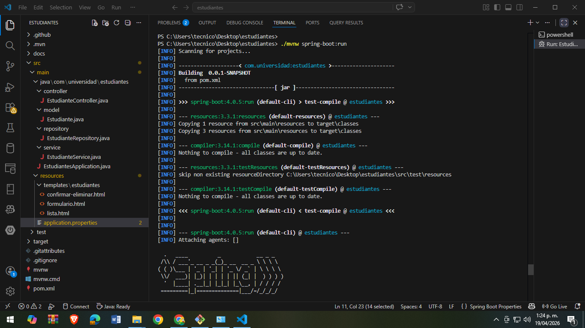
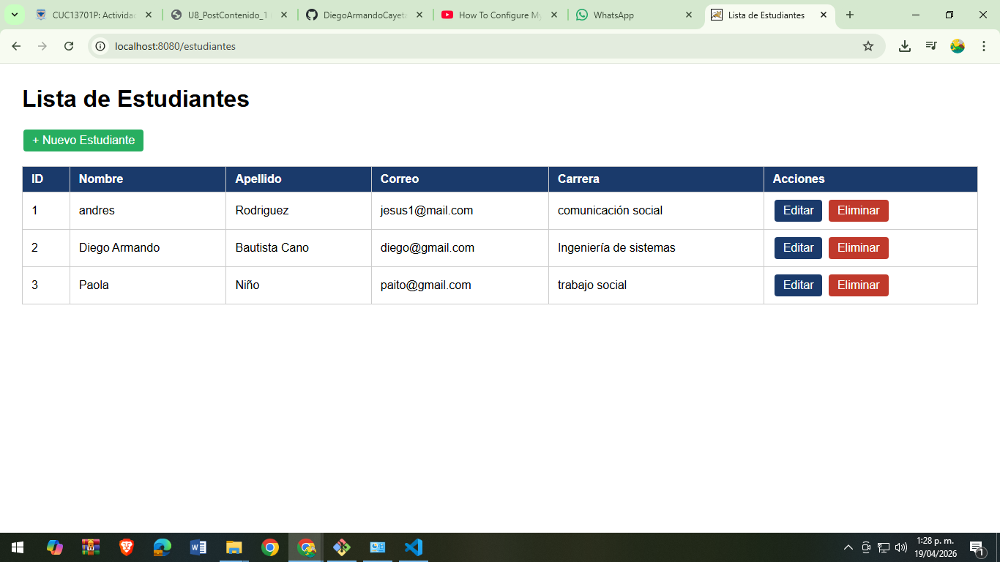
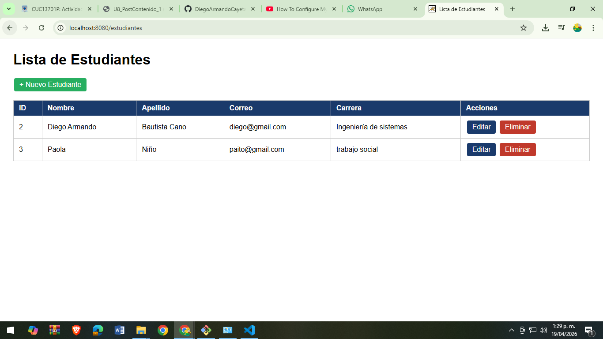
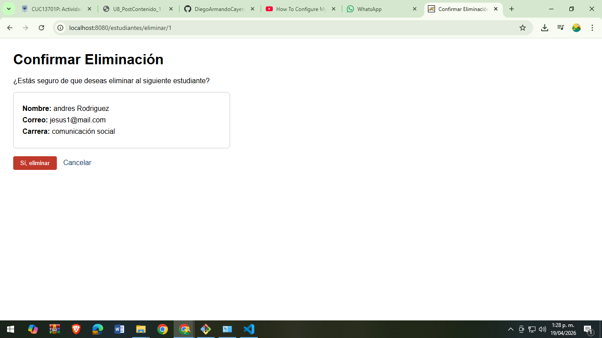

# CRUD Estudiantes - Spring Boot JPA/Hibernate

## 📌 Descripción del proyecto

Este proyecto implementa un CRUD completo de la entidad **Estudiante** utilizando Spring Boot, Spring Data JPA y Hibernate.  
Permite crear, listar, editar y eliminar estudiantes, con validaciones de datos y persistencia en base de datos en memoria (H2).

---

## ⚙️ Tecnologías utilizadas

- Java 17
- Spring Boot
- Spring Data JPA
- Hibernate
- H2 Database
- Thymeleaf
- Maven

---

## 🚀 Cómo ejecutar el proyecto

Ejecutar el siguiente comando en la terminal:

```bash
./mvnw spring-boot:run

Abrir en el navegador:

http://localhost:8080/estudiantes
🧱 Estructura del proyecto
controller/
service/
repository/
model/
templates/
🧪 Funcionalidades
Crear estudiantes
Listar estudiantes
Editar estudiantes
Eliminar estudiantes
Validación de campos
Validación de correo único

### ✔ Ejecución exitosa


### ✔ Crear 3 estudiantes


### ✔ Estudiante editado


### ✔ Estudiante eliminado


### ✔ Eliminación en lista


📌 Commits realizados
Configuración BD
Configuración de H2
application.properties
Entidad + Repository
Entidad Estudiante con validaciones JPA
JpaRepository
Controller + Vistas
CRUD completo
Thymeleaf
manejo de formularios
👨‍💻 Autor

Diego Armando Cayetano Bautista cANO
